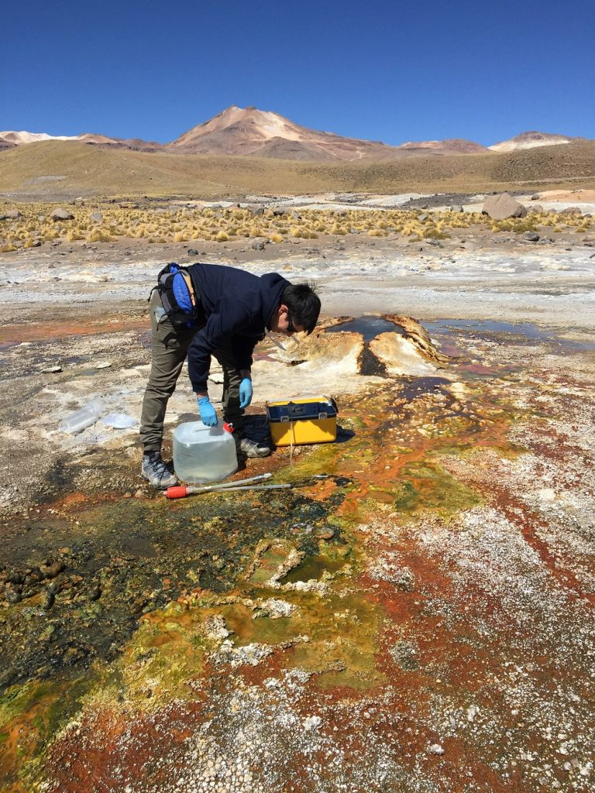
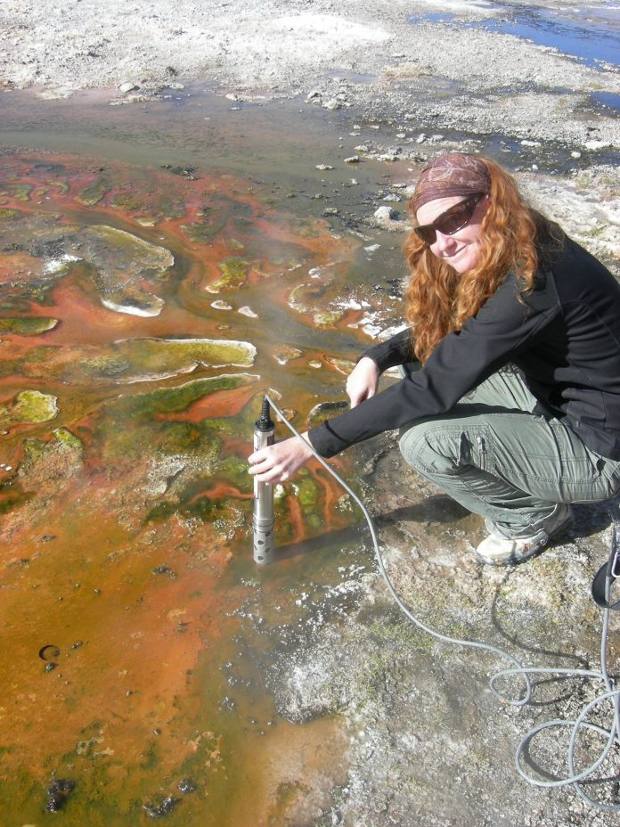
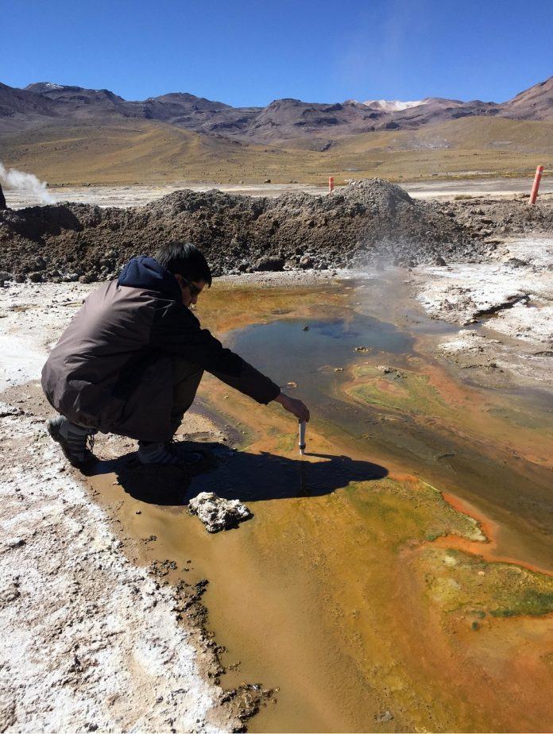

---
authors:
- admin
- OSalgado
- CBarbosa
categories:
- Interview
- Sciences
date: "2020-05-18T12:20:00Z"
lastmod: "2020-05-18T12:20:00Z"

draft: false
featured: false

image:
  caption: ''
  focal_point: ""
  placement: 1
  preview_only: true

projects: []
summary: "Entrevista Dra. Beatriz Díez - Ciencia en Chile (Mayo 28, 2020)"
title: "Campo de géiseres El Tatio, el laboratorio geotérmico más alto del mundo para conocer virus"
subtitle: "Entrevista Dra. Beatriz Díez para Ciencia en Chile"
tags: ["Women in Sciences", "El Tatio", "Ciencia en Chile"]
---

<figure>
  
</figure>

Un grupo de investigadores de Chile estudia a más de 4.200 msnm distintos virus existentes en el agua de los géiseres del campo geotérmico El Tatio, en la Cordillera de Los Andes, en pleno desierto de Atacama.  

**Lorenzo Palma, Ciencia en Chile**. Cada año el campo geotermal El Tatio es visitado por más de 100.000 turistas, pero también llegan científicos. Hace varios años que muestrean la zona, pero actualmente ejecutan una investigación Fondecyt, la cual permitió reunir a un grupo de investigadores nacionales,  liderado por la Dra. Beatriz Díez, de la Facultad de Ciencias Biológicas de la Pontificia Universidad Católica de Chile (PUC), junto a Diego Morata; Carla Barbosa, la estudiante de magíster de la Facultad de Ciencias Físicas y Matemáticas de la Universidad de Chile (UC) y la Dra. Raquel Quintrini de la Fundación Ciencia y Vida de la Universidad San Sebastián (USS), para estudiar las comunidades virales y sus interacciones con potenciales hospederos en el campo geotermal de El Tatio, ubicado a  89 kilómetros del pueblo de San Pedro de Atacama. 

El Tatio cuenta con más de 200 géiseres, fumarolas y piscinas termales, dispersos en un área de hasta 30 km2, siendo el campo geotermal más grande del hemisferio sur y el cuarto del mundo. Las condiciones ambientales en las que éste se emplaza son extremas, debido a su elevación por sobre los 4000 m.s.n.m., a sus escasas precipitaciones, a la alta radiación UV y a las oscilaciones térmicas diarias de hasta 35°C a las que está sometido. Las comunidades microbianas que existen en este campo geotermal han evolucionado en aislamiento por miles de años, y presentan altas tasas de endemismo dignas de estudiar para comprender de mejor manera las trayectorias de la evolución de la vida en La Tierra y eventualmente, en otros planetas como Marte, cuentan las investigadoras. 

La Dra. Díez, cuando visita El Tatio, se acerca lo más posible a las aguas hirviendo de los distintos geiseres que existen en el campo geotermal para lograr comprender los efectos que tienen las variables del ambiente, como la temperatura y el pH, así también para comprender cómo serán las diferencias entre virus entre un géiser y otro más distante. Todo esto, cuentan, les servirá para catalogar la biodiversidad viral y la dinámica bajo las condiciones ambientales y geológicas particulares que existen en El Tatio. 

<figure>
  
  <figcaption> Dra. Beatriz Díez, de la Facultad de Ciencias Biológicas de la Pontificia Universidad Católica de Chile (PUC). </figcaption>
</figure>

“**En estos momentos, en los que el mundo está en jaque por componentes mínimos e invisibles como el virus SARS-CoV2, y la enfermedad Covid-19 que estos causan, se hace evidente la importancia y la necesidad de obtener más y mejor información sobre la diversidad, identidad, función y actividad de los virus en la naturaleza. Sin esta información es difícil generar el conocimiento necesario para estar preparados y anticipar sus impactos en la salud humana o en la de nuestro medioambiente. Por diversas razones, muchos virus que no tienen como hospedero habitual a los humanos están convirtiéndose en un problema importante de salud pública**”, explica la investigadora. 

El equipo de trabajo comenzó el segundo año de cuatro, en el marco del proyecto Fondecyt Regular (N°1190998). Hasta la fecha, han logrado encontrar y georeferenciar más de 20 termas con similares condiciones físico-químicas y geológicas, con espléndidos tapetes microbianos creciendo en ellas, condición previa para ser seleccionadas y muestreadas. “**Esto junto con la puesta a punto de algunas metodologías tanto de muestreo como de procesado de muestras, nos va a permitir ahora llevar a cabo el trabajo planificado en algunos de los objetivos planteados en el proyecto. Con la pandemia no pudimos terminar nuestro muestreo del primer año y será necesario esperar a poder viajar de nuevo para obtener muestras de todas estas termas encontradas que cumplen con las condiciones necesarias para el estudio**” detalló la directora del a investigación. 

<figure>
  
  <figcaption> Campaña de muestreo en El Tatio. Oscar Salgado, estudiante de doctorado durante el muestreo. </figcaption>
</figure>

Esta investigación destaca por ser la primera que ha estudiado microorganismos nativos asociados a un ambiente tan particular como El Tatio, además es el primer estudio comprehensivo de ecología viral en tapetes microbianos, que son verdaderas alfombras de organismos, en este caso de aguas termales terrestres. 

Cuando usted visite EL Tatio podrá observar que algunos geiseres se pintan entre naranjo y verde, y esta coloración no es casual, sino el resultado de la interacción de organismos autotróficos, que forman alfombras microbianas, que no siempre es fácil de encontrar y que ocultan una diversidad totalmente nueva. Justo ahí se encuentran los virus y no existen ellos si no tienen un hospedero, por ende, están las bacterias y las arqueas, que son organismos procariotas unicelulares y filamentosos.  Todo un mundo por descubrir, cuentan los especialistas, del cual se sabe muy poco en el caso de los virus ¿cómo funcionan y evolucionan bajo estas condiciones extremas? Serán preguntas en las que seguirán profundizando durante los próximos tres años. 

<video width="320" height="240" controls>
  <source src="./Tatio.mp4" type=video/mp4>
</video>

Los investigadores dicen que quieren aportar para formar un repositorio de conocimiento científico de la zona, pero también cultural para Chile y el mundo, “**que además pueda ayudar a las comunidades originarias a lograr una mejor gestión y conservación del parque. Ojalá que en algún momento se logre nombrar al campo geotermal El Tatio como Patrimonio de la Humanidad**”, concluyó la doctora Beatriz Díez. 

 

También puedes leer la entrevista en su formato original en [Ciencia en Chile](https://www.cienciaenchile.cl/campo-de-geiseres-el-tatio-el-laboratorio-geotermico-mas-alto-del-mundo-para-conocer-virus/#:~:text=Papers-,Campo%20de%20géiseres%20El%20Tatio%2C%20el%20laboratorio%20geotérmico%20más,del%20mundo%20para%20conocer%20virus&text=Un%20grupo%20de%20investigadores%20de,en%20pleno%20desierto%20de%20Atacama)

