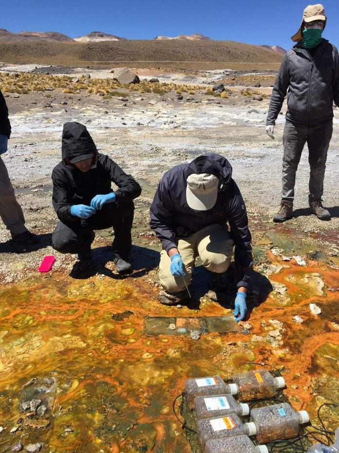
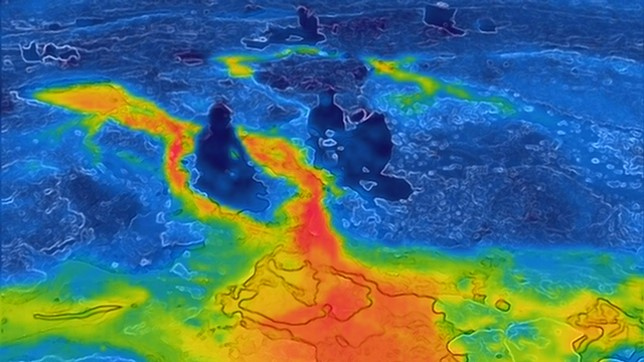
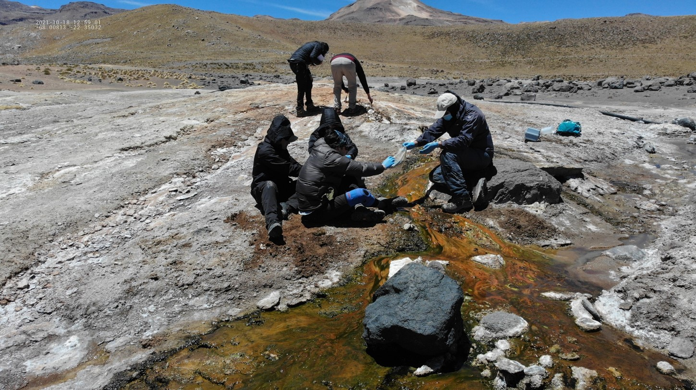
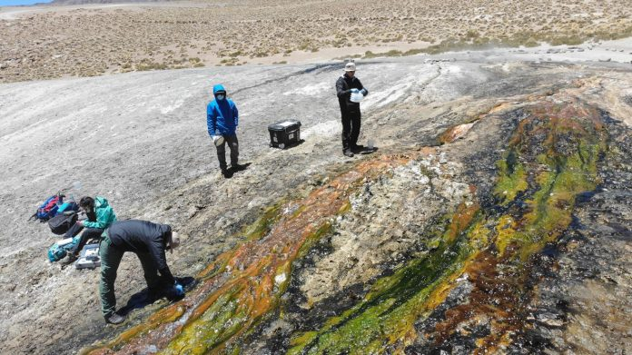

---
authors:
- admin
- OSalgado
- CBarbosa
categories:
- Interview
- Sciences
date: "2021-12-10T12:20:00Z"
lastmod: "2021-12-10T12:20:00Z"

draft: false
featured: false

image:
  caption: ''
  focal_point: ""
  placement: 1
  preview_only: true

projects: []
summary: "Entrevista Dra. Beatriz Díez - Ciencia en Chile (Diciembre 10, 2021)"
title: "Los virus que se ocultan en el agua termal del Tatio comienzan a ser identificados"
subtitle: "Entrevista Dra. Beatriz Díez para Ciencia en Chile"
tags: ["Women in Sciences", "El Tatio", "Ciencia en Chile"]
---

<figure>
  
</figure>

Sobre los 4.200 metros sobre el nivel del mar y durante 9 días un grupo de investigadores se enfocó en tomar muestras en 13 geiser del campo geotérmico El Tatio, en el desierto de Atacama.  

**Lorenzo Palma, Ciencia en Chile**. Cada año más de 100 mil visitantes llegan temprano en la mañana, cuando el sol todavía no aparece en la cordillera de Los Andes. Se esfuerzan aguantando el frío, la puna y levantándose temprano para ver algunos de los 40 géiseres o 60 termas y 70 fumarolas que forman el complejo. Dicen que se aprecia mejor antes que salga el sol para ver cómo emerge el agua a 90 grados centígrados y a una presión impresionante y peligrosa. 

El Tatio es, junto con Yellowstone en Estados Unidos y Kamchatka en Rusia, uno de los tres campos geotérmicos más grandes del mundo. Pero El Tatio está a tan solo 100 km de San Pedro de Atacama, en Chile. 

El Tatio o abuelo que llora como se le conoce en Kunza, tiene el récord como el complejo de géiseres más grande del hemisferio sur. También destaca por sus escasas precipitaciones, una alta radiación UV y oscilaciones térmicas diarias de hasta 35°C. 

Las comunidades microbianas que existen en este campo geotermal han evolucionado en aislamiento por miles de años, y podrían presentan altas tasas de endemismo dignas de estudiar para comprender de mejor manera las trayectorias de la evolución de la vida en La Tierra y eventualmente en otros planetas, es lo que comenta la Dra. Beatriz Díez de la Facultad de Ciencias Biológicas de la Universidad Católica de Chile. 

Este lugar pone a prueba las teorías ecológicas, como las relaciones entre los virus y sus hospederos, explica la investigadora de la Universidad Católica. El interés por tener muestras de las 13 termas fue encontrar sitios con características similares, tanto de la salinidad, el pH y la temperatura. Una de las preguntas que se plantearon fue ¿Si todas las condiciones ambientales son iguales en las termas, encontraremos los mismos organismos vivos en ellas? 

<figure>
  
</figure>

El grupo se cuestionó también entonces si al existir condiciones similares entre las termas ¿existen virus distintos o serían los mismos que infectan a las mismas comunidades de organismos vivos que las habitan?. La Dra. Díez explica que es importante en ecología entender si es verdad que todo está en todas partes y solo las condiciones del ambiente están seleccionando la presencia o no de un determinado organismo en ellas y, por tanto, sus relaciones con otros organismos, como en este caso entre un virus y su hospedero. 

Hasta ahora las primeras investigaciones de la Dra. Díez señalan de presencia de muchos virus en estas termas que podrían infectar a bacterias termófilas.  “**Estamos trabajando para identificar hospederos específicos y para descubrir que virus son los más activos. Hemos descubierto también junto con el estudiante de doctorado Oscar Salgado de la Universidad Católica, que muchas de estas bacterias termófilas de El Tatio poseen mecanismos de inmunidad adaptativa llamados sistemas CRISPR-Cas, que ayudarían a estas bacterias a defenderse de estos virus, los cuales tienen que mutar para poder volver a conseguir infectar a estas bacterias, y este juego predador-presa mantiene estas comunidades activamente luchando por su existencia en estos ambientes extremos a altas temperaturas**”.

**Colaboración entre equipos**

<figure>
  
</figure>

La Dra. Díez y su equipo del Laboratorio de Ecología Microbiana de Sistemas Extremos no estuvo sola durante los 9 días en El Tatio, la acompañaron estudiantes e investigadores, como Simón Beard, del Laboratorio de Ecofisiología Microbiana de la Fundación Ciencias & Vida, dirigido por la Dra. Raquel Quatrini. Simón, mencionó que los microorganismos estudiados tienen un papel ecológico muy relevante, ya que participan en los ciclos de elementos como el carbono, nitrógeno y azufre. “**Este trabajo colaborativo hizo de este viaje una experiencia sumamente enriquecedora, con un equipo muy profesional y en un ambiente muy grato, el cual nos permitió conocer y aprender de las experiencias del grupo de la Dra. Beatriz Díez sobre sistemas termales no acidófilos, y a la vez aportar con nuestras propias experiencias y conocimientos para conseguir los objetivos de este viaje**”, destacó Simón Beard, de la Fundación Ciencias & Vida. 

Además, la geóloga del grupo, Carla Barbosa Troncoso, estudiante de Magíster de la Universidad de Chile, dirigida por el Dr. Diego Morata, también los acompaño por segunda vez en esta expedición a El Tatio, donde en la primera salida de enero 2020 se encargó de tomar muestras de agua de las fuentes termales para analizar la química, y ahora se preocupó de identificar fuentes termales, y medir de nuevo parámetros fisicoquímicos, registro fotográfico y coordenadas. 

Esta investigación destaca por ser la primera que ha estudiado microorganismos nativos asociados a un ambiente tan particular como El Tatio, además es el primer estudio comprehensivo de ecología viral en tapetes microbianos, que son verdaderas alfombras de organismos, en este caso de aguas termales terrestres. 

Cuando usted visite El Tatio podrá observar que algunos geiseres se pintan entre naranjo y verde, y esta coloración no es casual, sino el resultado de la interacción de organismos autotróficos, que utilizan el CO2 del ambiente para generar materia orgánica, que forman tapetes microbianos no siempre fáciles de encontrar y que ocultan todavía una gran diversidad e interacciones biológicas por explorar. Justo ahí se encuentran los virus y no existen ellos si no tienen un organismo hospedero al que infectar, que son mayormente en estos ambientes las bacterias y las arqueas, que son organismos procariotas unicelulares y, algunos de ellos filamentosos. Todo un mundo por explorar, cuentan los especialistas, del cual una de las componentes que se sabe menos es el caso de los virus ¿cómo funcionan, ha quién infectan y como evolucionan junto a sus hospederos bajo estas condiciones extremas a altas temperaturas? Estas y otras preguntas son las que están respondiendo los investigadores en el proyecto ANID_Fondecyt Regular 1190998 que dirige la Dra. Díez. 

Para obtener información de los virus, se estudiaron los tapetes microbianos en esta expedición donde participaron estudiantes como Felipe Loyola (Magíster de la Universidad de Chile) cuya tutora es la Dra. Díez en la Universidad Católica. Él se dedicó, junto a otros estudiantes, a obtener las muestras para poder secuenciar todos los genomas virales o metaviromas, presentes en más de 20 tapetes microbianos obtenidos de diferentes termas, y para lograrlo, cuenta, se recolectó trozos del tapete microbiano, luego se presionó a través de una malla de 35 micrones para obtener el líquido que contienen y que arrastra a los virus con él, hasta llenar bidones que se guardaban en oscuridad. 

<figure>
  
</figure>

Una vez en el laboratorio que montaron en el hostal donde se alojaron en San Pedro de Atacama, el equipo preparó un sistema de filtración basado en bombas peristálticas donde el líquido intersticial obtenido del tapete estrujado, corría a través de unas mangueras que estaban conectadas a distintos filtros para ir eliminando los distintos tipos celulares y obtener finalmente la fracción viral necesaria para obtener el metaviroma. 

“**Una vez filtrado todo el líquido intersticial, lo que hicimos fue concentrar los virus obtenidos mediante una técnica de floculación (precipitación) utilizando cloruro férrico, donde luego de incubar con este reactivo se forman flóculos (agregados) de los virus, lo que nos permitió después filtrar estos flóculos y retenerlos en un filtro (una pequeña malla de 1 μm), utilizando el mismo sistema de filtración de bombas. Esto se almacena y posteriormente se extrae su ADN para secuenciarlos, y finalmente analizar las comunidades virales mediante distintas herramientas bioinformáticas**”, explicó Felipe Sepúlveda, estudiante de doctorado de la Universidad Católica. 

Los investigadores dicen que quieren aportar para formar un repositorio de conocimiento científico de la zona, pero también cultural para Chile y el mundo, “**que además pueda ayudar a las comunidades originarias a lograr una mejor gestión y conservación del parque. Ojalá que en algún momento se logre nombrar al campo geotermal El Tatio como Patrimonio de la Humanidad**”, concluyó la doctora Beatriz Díez. 

 

También puedes leer la entrevista en su formato original en [Ciencia en Chile]https://www.cienciaenchile.cl/los-virus-que-se-ocultan-en-el-agua-termal-del-tatio-comienzan-a-ser-identificados/)

