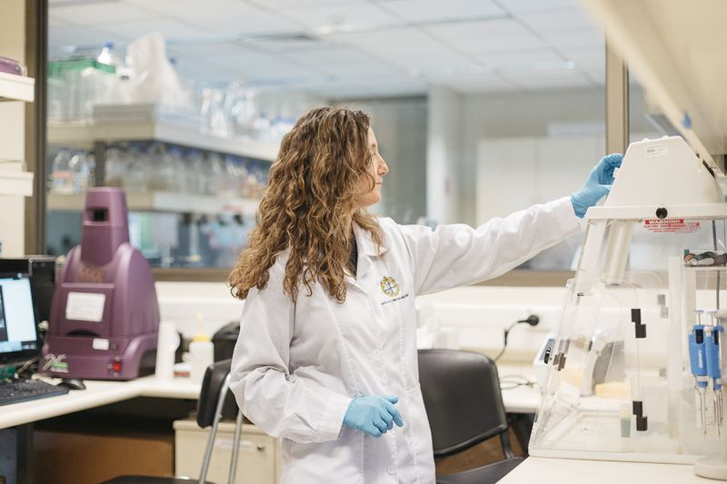

---
authors:
- admin
categories:
- Interview
- Sciences
date: "2019-04-25T12:20:00Z"
lastmod: "2019-04-25T12:20:00Z"

draft: false
featured: false

image:
  caption: 'Por Kalu Downey / Fotos: Mila Belén - Revista Paula La Tercera'
  focal_point: ""
  placement: 2
  preview_only: false

projects: []
summary: "Entrevista Dra. Beatriz Díez para Revista Paula - La Tercera (Abril 25, 2019)"
title: "El paraíso de una ecóloga microbiana"
subtitle: "Entrevista Dra. Beatriz Díez para Revista Paula - La Tercera"
tags: ["Women in Sciences"]
---

Para Beatriz Díez (47) todo se trata del mar, esa masa oscura e inconmensurable que aloja parte importante de los misterios científicos. Criada a orillas del Mediterráneo, esta investigadora española que actualmente vive en Chile, creció sintiendo que lo que faltaba por descubrir en las profundidades del océano era tan pequeño e infinito que pasaría inadvertido ante el interés humano, y que lo mismo ocurriría con el mar de células que vivía bajo sus pies.   

Beatriz Díez era una niña curiosa, al menos eso recuerda. En su natal Alicante, España, soñaba con ser arqueóloga. Quería meterse en sitios complejos y descubrir cosas nuevas, como por qué las piedras eran de distintos tamaños o entender por qué algunas tenían colores diferentes. En ese entonces, sentía que el planeta era mucho más que una montaña estática o un desierto infértil. Algo le decía que había un mundo vivo alucinante escondido detrás de sus formas. Por eso, decidió estudiar Ciencias Biológicas y dedicarse a observar, microscopio en mano, el comportamiento de la parte más pequeña de los organismos vivos: los microorganismos.  

Para esta científica pionera en el uso de metodologías de la biología molecular en el estudio de la vida marítima, el mar es una necesidad. Por eso, a los 24 años decidió emigrar hasta la Universidad Autónoma de Barcelona y estudiar un doctorado que terminaría siendo el trampolín a una prolífica carrera en las ciencias. Durante su doctorado en el Instituto de Ciencias del Mar, del Consejo Superior de Investigaciones Científicas (CSIC) en España, trabajó en el antiguo acuario de Barcelona, a pocos metros del emblemático barrio de la Barceloneta. Para ella, ese lugar donde tocaría la cima del prestigio científico por su metodología y análisis microbiano de la vida marina —algo que muy poca gente hacía en ese entonces—, emanaba inspiración y amor por la vida marina.  

Cuenta que por esos años podría haber estudiado a las ballenas, porque sin duda le encantaban, pero escogió ir al inicio de la cadena trófica, donde están los virus, las bacterias y toda clase de organismos pequeños que a simple vista nadie ve. "Aún sabemos muy poco sobre cuántos son, qué es lo que hacen, cómo se relacionan entre ellos, qué los estresa, para qué nos podrían servir o cómo los afectamos. Lo que sí sabemos con certeza es que la vida marina es un amalgama de ciclos biogeoquímicos complejos que empiezan y terminan en los microorganismos más pequeños de la cadena. Un mayor entendimiento de ellos podría llevarnos a resolver problemas gigantescos, como la supervivencia en un lugar con temperaturas extremas, menos oxígeno y menos agua", comenta pensando en aquellos organismos extremófilos que han logrado sobrevivir donde ningún ser vivo superior, incluido el humano, lo ha conseguido sin ayuda.  

Siguiendo esa línea de investigación y yendo más allá de una película de ficción sobre la vida en otros mundos, en 2010 Beatriz Díez llegó a la Facultad de Ciencias Biológicas de la Universidad Católica de Chile y allí instaló su laboratorio. Desde aquel lugar, trabaja a diario por avanzar en el entendimiento de cómo sobrevive la vida microbiana en los diversos ambientes extremos de Chile y la Antártica, los que a su vez han sido destacados por la NASA como lugares de interés para evaluar distintas alternativas de vida humana en otros planetas.  

<h3> ¿Por qué decidiste trabajar en Chile y no en la NASA? </h3>

Llegué a Chile por casualidad. Después de estudiar por varios años la biodiversidad de los microorganismos de los océanos, como el Mediterráneo en España y el Índico y el Ártico en Suecia, recibí una invitación para postular a un cargo en el Departamento de Genética Molecular y Microbiología de la UC. Yo conocía científicos españoles que amaban este país, pero nunca había estado aquí. En mi primera búsqueda en Google vi que había glaciares milenarios, más de 80 volcanes activos con incontables ambientes termales, el desierto más árido del planeta y una costa de más de 4.300 kms de norte a sur. ¡Los microorganismos de este lugar han sobrevivido a todo eso! Me demoré cinco segundos en ver que este país era el paraíso para una microbióloga ambiental y ecóloga microbiana como yo.  

<figure>
  
  <figcaption> Laboratorio Dra. Beatriz Díez (PUC). Fotos: Mila Belén - Revista Paula La Tercera </figcaption>
</figure>

<h3> Suena a que hacer investigación microbiana en Chile es un sueño. ¿Es tan así? </h3>

Hay que ir por partes. Antes que eso, Chile ofrece una de las oportunidades más interesantes de hacer un aporte real a la ciencia: formar una escuela de ecólogos microbianos en un país extremo, en la mitad de un laboratorio natural tan fascinante que está en la mira de la NASA por sus condiciones climáticas y geoquímicas. Y en eso estoy yo ahora, haciendo academia, compartiendo el laboratorio y las expediciones a la Antártica, a San Pedro de Atacama, a la Patagonia o a dónde sea con jóvenes de pre y postgrado cuya pasión es investigar la microbiología. Sin embargo, la microbiota de este país, la parte más pequeña del ecosistema, ha sido súper inexplorada. Hoy todos sabemos que en el Norte están los cielos más despejados para ver un mar de estrellas, pero con ese mar de células que está a nuestros pies hay una deuda interesante de metodologías y difusión.  

<h3> ¿Y qué se podría hacer para cambiar esta situación? </h3>

Creo que Chile debiese influenciar la ciencia y la astrobiología mundial, porque todo lo que tiene que ver con encontrar vida y adaptaciones en sitios inesperados como los géiseres o los glaciares, es la bandera que falta para ayudar al conocimiento de un nuevo mundo desconocido.  

<h3> ¿Cómo se responde desde la microbiología a esos fenómenos que están haciendo que pensemos en vivir en otros mundos? </h3>

Uno solo tiene que explicar cómo surgió la vida en este planeta y cómo ha evolucionado para dar respuesta a eso. Los microorganismos han estado aquí por siempre y ellos se han adaptado para poder sobrevivir bajo cualquier condición por extrema o perturbadora que sea, incluido los cambios de clima. Ellos están respondiendo todo el tiempo sobre la mejor forma de habitar este planeta y ahora nos toca aprender de eso. Porque esto es urgente. Como humanidad tenemos poco tiempo y muchos obstáculos debido al perjuicio que causó nuestra evolución.   

<h3> Hablando de evolución, según cifras de la Unesco, en Chile solo un 32% de la investigación científica es protagonizada por mujeres. ¿Por qué crees que ocurre eso? </h3>

Soy curiosa por naturaleza y creo que hay muchas mujeres en el mundo que también lo son, pero viven bajo circunstancias o una cultura que no las potencia como investigadoras. Hablar de este tema es complejo, porque todos tenemos culpa. Pero a la vez, todos tenemos el potencial y la responsabilidad de hacer cambios. Tuve la suerte de vivir en Suecia, uno de los países que ha hecho un mayor esfuerzo por la igualdad. Y como mujer, como investigadora, como peatona, eso se nota. La igualdad permea a la comunidad y empodera a las mujeres para tomar posiciones de liderazgo. Me encantaría ver que algo así ocurra pronto aquí.   

<figure>
  
  <figcaption> Dra. Beatriz Díez. Fotos: Mila Belén - Revista Paula La Tercera </figcaption>
</figure>

<h3> ¿Cómo se podría motivar la participación de niñas y jóvenes en las ciencias? </h3>

Las mujeres en ciencias animan a que más mujeres vayan hacia la ciencia. Visibilizar casos de científicas innovadoras, creativas, que con un sacrificio enorme han sido exitosas, motiva a otras a seguir este camino. Eso y pasarlo bien como investigadora y como persona, no ver límites dentro de uno, más allá de si eres hombre, mujer o una niña. Eso es inspirador. Creo que la sensibilidad y la creatividad que tienen muchas mujeres chilenas las va hacer triunfar una vez que consigan echar abajo los límites y las barreras. Esta es una lucha por la razón y la fuerza que va a durar mucho tiempo, porque la evolución es lenta y a veces la adaptación puede ser dolorosa, pero creo que este es un buen momento a nivel planeta y Chile no se va a quedar atrás.  

<h3> Como los microorganismos, que constantemente están tratando de saltar sus limitaciones para evolucionar y adaptarse, ¿no? </h3>

Esto es cuestión de adaptarse día a día y evolucionar para conseguir una meta y ser feliz, no porque las mujeres creamos que somos más inteligentes o mejores, sino porque tenemos los mismos potenciales y queremos contribuir. Y realmente sabemos cómo hacerlo.  

 

También puedes leer la entrevista en su formato original en [Revista Paula - La Tercera](https://www.latercera.com/paula/paraiso-una-ecologa-microbiana/)

